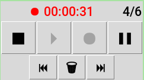

# Really Simple Voice Recorder

Simple sound-manipulating program written using Tkinter and PyAudio.
[RBDE](https://github.com/OutOfContainment/RBDE) rewritten in python because someone thinks I have nothing better to do.

Slow, ugly, and most importanly, *✨OOP✨*
Written in 2 days, learning project.

## Run
```sh
git clone https://github.com/OutOfContainment/RSVR.git && cd ./RSVR
python ./main.py
```
